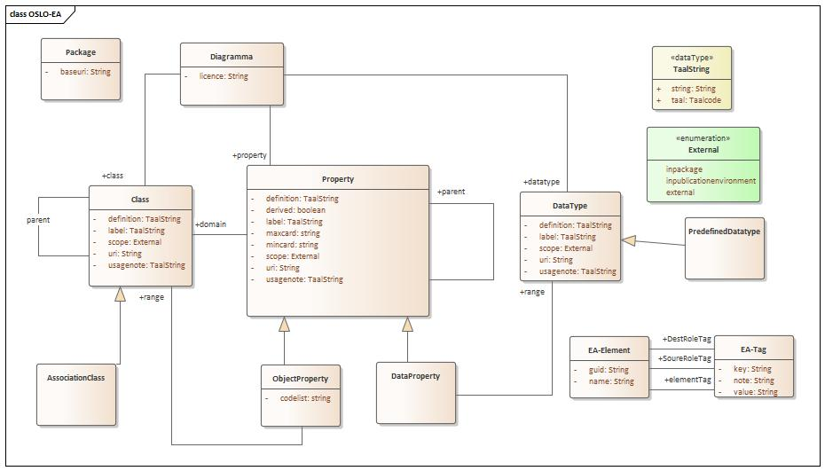
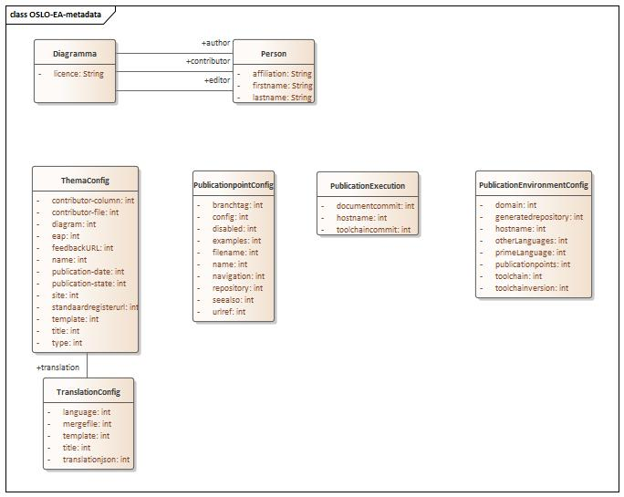

# OSLO Toolchain

The OSLO toolchain is an open-source software environment that makes it possible to make an OSLO specification document from a UML model.
This software environment consists of various modules that according to the needs of the users can be wired together in a workflow via configuration.
This workflow consists of two parts:
- A converter → converts a UML diagram to an RDF file (we chose JSON-LD)
- One or more generators → use the JSON-LD file as input to generate various artefacts

The two parts of the workflow can be executed individually.

## Domain model of the JSON-LD

All converters must transforms the UML diagram to an RDF file that adheres to the following domain model.
 

## Copyright

This code is copyrighted by [Digitaal Vlaanderen](https://www.vlaanderen.be/digitaal-vlaanderen) and released under the [MIT license](./LICENSE)